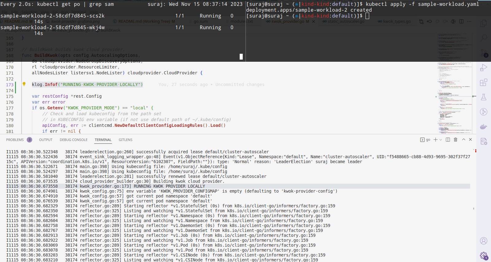
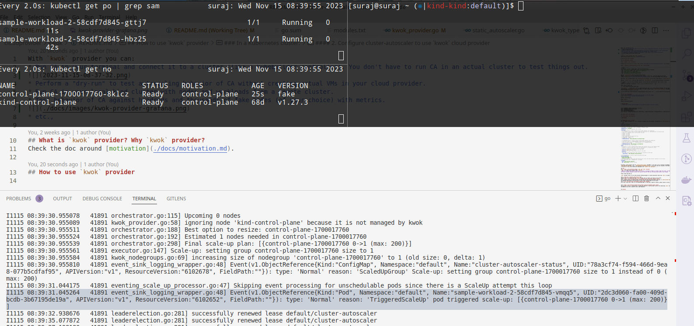
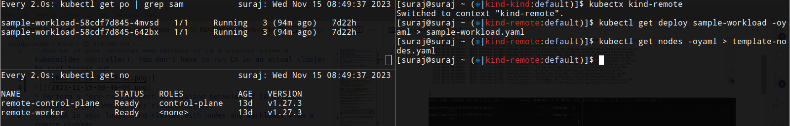
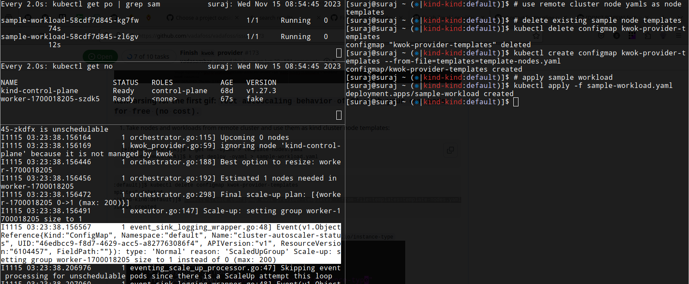
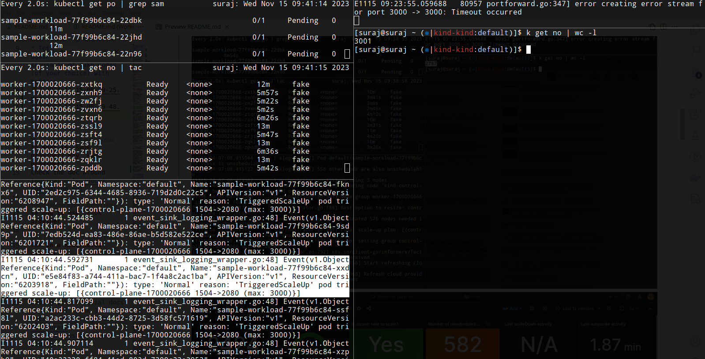
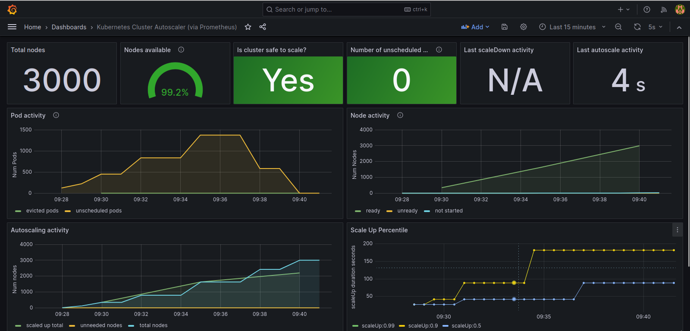
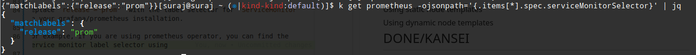
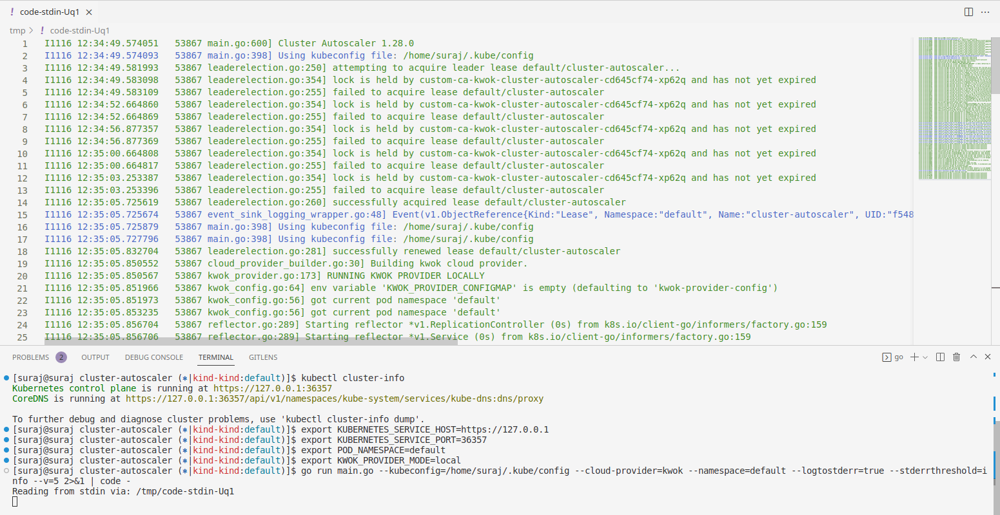
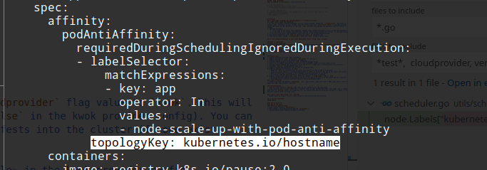

With the `kwok` provider you can:
* Run **CA** (cluster-autoscaler) in your terminal and connect it to a cluster (like a kubebuilder controller). You don't have to run CA in an actual cluster to test things out.


* Perform a "dry-run" to test the autoscaling behavior of CA without creating actual VMs in your cloud provider.
* Run CA in your local kind cluster with nodes and workloads from a remote cluster (you can also use nodes from the same cluster).


* Test the behavior of CA against a large number of fake nodes (of your choice) with metrics.


* etc.,

## What is a `kwok` provider? Why `kwok` provider?
Check the doc around [motivation](./docs/motivation.md).

## How to use `kwok` provider

### In a Kubernetes cluster:

#### 1. Install `kwok` controller

Follow [the official docs to install `kwok`](https://kwok.sigs.k8s.io/docs/user/kwok-in-cluster/) in a cluster.

#### 2. Configure cluster-autoscaler to use `kwok` cloud provider

*Using helm chart*:
```shell
helm repo add cluster-autoscaler https://kubernetes.github.io/autoscaler
helm upgrade --install <release-name> cluster-autoscaler/cluster-autoscaler  \
--set "serviceMonitor.enabled"=true --set "serviceMonitor.namespace"=default \
--set "cloudProvider"=kwok --set "image.tag"="<image-tag>" \
--set "image.repository"="<image-repo>" \
--set "autoDiscovery.clusterName"="kind-kind" \
--set "serviceMonitor.selector.release"="prom"
```
Replace `<release-name>` with the release name you want.
Replace `<image-tag>` with the image tag you want. Replace `<image-repo>` with the image repo you want
(check [releases](https://github.com/kubernetes/autoscaler/releases) for the official image repos and tags)

Note that the `kwok` provider doesn't use `autoDiscovery.clusterName`. You can use a fake value for `autoDiscovery.clusterName`.

Replace `"release"="prom"` with the label selector for `ServiceMonitor` in your grafana/prometheus installation.

For example, if you are using the prometheus operator, you can find the service monitor label selector using
```shell
kubectl get prometheus -ojsonpath='{.items[*].spec.serviceMonitorSelector}' | jq # using jq is optional
```
Here's what it looks like


`helm upgrade ...` command above installs cluster-autoscaler with `kwok` cloud provider settings. The helm chart by default installs a default kwok provider configuration (`kwok-provider-config` ConfigMap) and sample template nodes (`kwok-provider-templates` ConfigMap) to get you started. Replace the content of these ConfigMaps according to your need.

If you already have cluster-autoscaler running and don't want to use `helm ...`, you can make the following changes to get kwok provider working:
1. Create `kwok-provider-config` ConfigMap for kwok provider config
2. Create `kwok-provider-templates` ConfigMap for node templates
3. Set `POD_NAMESPACE` env variable in the CA Deployment (if it is not there already)
4. Set `--cloud-provider=kwok` in the CA Deployment
5. That's all.

For 1 and 2, you can refer to the helm chart for the ConfigMaps. You can render them from the helm chart using:
```
helm template charts/cluster-autoscaler/  --set "cloudProvider"="kwok" -s templates/configmap.yaml --namespace=default
```
Replace `--namespace` with the namespace where your CA pod is running.

If you want to temporarily revert to your previous cloud provider, just change the `--cloud-provider=kwok`.
No other provider uses `kwok-provider-config` and `kwok-provider-templates` ConfigMap (you can keep them in the cluster or delete them if you want to revert completely). `POD_NAMESPACE` is used only by the kwok provider (at the time of writing this).

#### 3. Configure `kwok` cloud provider
Decide if you want to use static template nodes or dynamic template nodes ([check the FAQ](#3-what-is-the-difference-between-static-template-nodes-and-dynamic-template-nodes) to understand the difference).

If you want to use static template nodes,

`kwok-provider-config` ConfigMap in the helm chart by default is set to use static template nodes (`readNodesFrom` is set to `configmap`). CA helm chart also installs a `kwok-provider-templates` ConfigMap with sample node yamls by default. If you want to use your own node yamls,
```shell
# delete the existing configmap
kubectl delete configmap kwok-provider-templates
# create a new configmap with your node yamls
kubectl create configmap kwok-provider-templates --from-file=templates=template-nodes.yaml
```
Replace `template-nodes.yaml` with the path to your template nodes file.

If you are using your template nodes in the `kwok-provider-templates` ConfigMap, make sure you have set the correct value for `nodegroups.fromNodeLabelKey`/`nodegroups.fromNodeAnnotation`. Not doing so will make CA not scale up nodes (it won't throw any error either).

If you want to use dynamic template nodes,

Set `readNodesFrom` in `kwok-provider-config` ConfigMap to `cluster`. This tells the kwok provider to use live nodes from the cluster as template nodes.

If you are using live nodes from the cluster as template nodes in the `kwok-provider-templates` ConfigMap, make sure you have set the correct value for `nodegroups.fromNodeLabelKey`/`nodegroups.fromNodeAnnotation`. Not doing so will make CA not scale up nodes (it won't throw any error either).

### For local development
1. Point your kubeconfig to the cluster where you want to test your changes
using [`kubectx`](https://github.com/ahmetb/kubectx):
```
kubectx <cluster-name>
```
Using `kubectl`:
```
kubectl config get-contexts

```
2. Create `kwok-provider-config` and `kwok-provider-templates` ConfigMap in the cluster you want to test your changes.

This is important because even if you run CA locally with the kwok provider, the kwok provider still searches for the `kwok-provider-config` ConfigMap and `kwok-provider-templates` (because by default `kwok-provider-config` has `readNodesFrom` set to `configmap`) in the cluster it connects to.

You can create both the ConfigMap resources from the helm chart like this:

```shell
helm template charts/cluster-autoscaler/  --set "cloudProvider"="kwok" -s templates/configmap.yaml --namespace=default | kubectl apply -f -
```
`--namespace` has to match `POD_NAMESPACE` env variable you set below.

3. Run CA locally

```shell
# replace `KUBERNETES_SERVICE_HOST` and `KUBERNETES_SERVICE_PORT`
# with your kubernetes api server url
# you can find it with `kubectl cluster-info`
# example:
# $ kubectl cluster-info
# Kubernetes control plane is running at https://127.0.0.1:36357
# ...
export KUBERNETES_SERVICE_HOST=https://127.0.0.1
export KUBERNETES_SERVICE_PORT=36357
# POD_NAMESPACE is the namespace where you want to look for
# your `kwok-provider-config` and `kwok-provider-templates` ConfigMap
export POD_NAMESPACE=default
# KWOK_PROVIDER_MODE tells the kwok provider that we are running the CA locally
export KWOK_PROVIDER_MODE=local
# `2>&1` redirects both stdout and stderr to VS Code (remove `| code -` if you don't use VS Code)
go run main.go --kubeconfig=/home/suraj/.kube/config --cloud-provider=kwok --namespace=default --logtostderr=true --stderrthreshold=info --v=5 2>&1 | code -
```

This is what it looks like in action:


## Tweaking the `kwok` provider
You can change the behavior of the `kwok` provider by tweaking the kwok provider configuration in `kwok-provider-config` ConfigMap:

```yaml
# only v1alpha1 is supported right now
apiVersion: v1alpha1
# possible values: [cluster,configmap]
# cluster: use nodes from the cluster as template nodes
# configmap: use node yamls from a configmap as template nodes
readNodesFrom: configmap
# nodegroups specifies nodegroup level config
nodegroups:
  # fromNodeLabelKey's value is used to group nodes together into nodegroups
  # For example, say you want to group nodes with the same value for `node.kubernetes.io/instance-type`
  # label as a nodegroup. Here are the nodes you have:
  # node1: m5.xlarge
  # node2: c5.xlarge
  # node3: m5.xlarge
  # Your nodegroups will look like this:
  # nodegroup1: [node1,node3]
  # nodegroup2: [node2]
  fromNodeLabelKey: "node.kubernetes.io/instance-type"

  # fromNodeAnnotation's value is used to group nodes together into nodegroups
  # (basically same as `fromNodeLabelKey` except based on annotation)
  # you can specify either of `fromNodeLabelKey` OR `fromNodeAnnotation`
  # (both are not allowed)
  fromNodeAnnotation: "eks.amazonaws.com/nodegroup"
# nodes specifies node level config
nodes:
  # skipTaint is used to enable/disable adding kwok provider taint on the template nodes
  # default is false so that even if you run the provider in a production cluster
  # you don't have to worry about the production workload
  # getting accidentally scheduled on the fake nodes
  skipTaint: true # default: false
  # gpuConfig is used to specify gpu config for the node
  gpuConfig:
    # to tell the kwok provider what label should be considered as GPU label
    gpuLabelKey: "k8s.amazonaws.com/accelerator"

# availableGPUTypes is used to specify available GPU types
availableGPUTypes:
 "nvidia-tesla-k80": {}
 "nvidia-tesla-p100": {}
# configmap specifies config map name and key which stores the kwok provider templates in the cluster
# Only applicable when `readNodesFrom: configmap`
configmap:
  name: kwok-provider-templates
  key: kwok-config # default: config
```

By default, the kwok provider looks for `kwok-provider-config` ConfigMap. If you want to use a different ConfigMap name, set the env variable `KWOK_PROVIDER_CONFIGMAP` (e.g., `KWOK_PROVIDER_CONFIGMAP=kpconfig`). You can set this env variable in the helm chart using `kwokConfigMapName` OR you can set it directly in the cluster-autoscaler Deployment with `kubectl edit deployment ...`.

### FAQ
#### 1. What is the difference between `kwok` and the `kwok` provider?
`kwok` is an open source project under `sig-scheduling`.
> KWOK is a toolkit that enables setting up a cluster of thousands of Nodes in seconds. Under the scene, all Nodes are simulated to behave like real ones, so the overall approach employs a pretty low resource footprint that you can easily play around with on your laptop.

https://kwok.sigs.k8s.io/

`kwok` provider refers to the cloud provider extension/plugin in cluster-autoscaler which uses `kwok` to create fake nodes.

#### 2. What does a template node exactly mean?
A template node is the base node yaml the `kwok` provider uses to create a new node in the cluster.
#### 3. What is the difference between static template nodes and dynamic template nodes?
Static template nodes are template nodes created using the node yaml specified by the user in `kwok-provider-templates` ConfigMap while dynamic template nodes are template nodes based on the node yaml of the current running nodes in the cluster.
#### 4. Can I use both static and dynamic template nodes together?
As of now, no you can't (but it's an interesting idea). If you have a specific usecase, please create an issue and we can talk more there!


#### 5. What is the difference between the kwok provider config and template nodes config?
kwok provider config is a configuration to change the behavior of the kwok provider (and not the underlying `kwok` toolkit) while template nodes config is the ConfigMap you can use to specify static node templates.


### Gotchas
1. The kwok provider by default taints the template nodes with `kwok-provider: true` taint so that production workloads don't get scheduled on these nodes accidentally. You have to tolerate the taint to schedule your workload on the nodes created by the kwok provider. You can turn this off by setting `nodes.skipTaint: true` in the kwok provider config.
2. Make sure the label/annotation for `fromNodeLabelKey`/`fromNodeAnnotation` in the kwok provider config is actually present on the template nodes. If it isn't present on the template nodes, the kwok provider will not be able to create new nodes.
3. Note that the kwok provider makes the following changes to all the template nodes:
(pseudocode)
```
node.status.nodeInfo.kubeletVersion = "fake"
node.annotations["kwok.x-k8s.io/node"] = "fake"
node.annotations["cluster-autoscaler.kwok.nodegroup/name"] = "<name-of-the-nodegroup>"
node.spec.providerID = "kwok:<name-of-the-node>"
node.spec.taints = append(node.spec.taints, {
		key:    "kwok-provider",
		value:  "true",
		effect: "NoSchedule",
	})
```

## I have a problem/suggestion/question/idea/feature request. What should I do?
Awesome! Please:
* [Create a new issue](https://github.com/kubernetes/autoscaler/issues/new/choose) around it. Mention `@vadasambar` (I try to respond within a working day).
* Start a slack thread aruond it in kubernetes `#sig-autoscaling` channel (for invitation, check [this](https://slack.k8s.io/)). Mention `@vadasambar` (I try to respond within a working day)
* Add it to the [weekly sig-autoscaling meeting agenda](https://docs.google.com/document/d/1RvhQAEIrVLHbyNnuaT99-6u9ZUMp7BfkPupT2LAZK7w/edit) (happens [on Mondays](https://github.com/kubernetes/community/tree/master/sig-autoscaling#meetings))

Please don't think too much about creating an issue. We can always close it if it doesn't make sense.

## What is not supported?
* Creating kwok nodegroups based on the `kubernetes/hostname` node label. Why? Imagine you have a `Deployment` (replicas: 2) with pod anti-affinity on the `kubernetes/hostname` label like this:

Imagine you have only 2 unique hostname values for the `kubernetes/hostname` node label in your cluster:
   * `hostname1`
   * `hostname2`

  If you increase the number of replicas in the `Deployment` to 3, CA creates a fake node internally and runs simulations on it to decide if it should scale up. This fake node has `kubernetes/hostname` set to the name of the fake node which looks like `template-node-xxxx-xxxx` (the second `xxxx` is random). Since the value of `kubernetes/hostname` on the fake node is not `hostname1` or `hostname2`, CA thinks it can schedule the `Pending` pod on the fake node and hence keeps on scaling up to infinity (or until it can't).


## Troubleshooting
1. Pods are still stuck in `Running` even after CA has cleaned up all the kwok nodes
    * The `kwok` provider doesn't drain the nodes when it deletes them. It just deletes the nodes. You should see pods running on these nodes change from a `Running` state to a `Pending` state in a minute or two. But if you don't, try scaling down your workload and scaling it up again. If the issue persists, please create an issue :pray:.

## I want to contribute
Thank you ❤️

It is expected that you know how to build and run CA locally. If you don't, I recommend starting from the [`Makefile`](https://github.com/kubernetes/autoscaler/blob/master/cluster-autoscaler/Makefile). Check the CA [FAQ](https://github.com/kubernetes/autoscaler/blob/master/cluster-autoscaler/FAQ.md) to know more about CA in general ([including info around building CA and submitting a PR](https://github.com/kubernetes/autoscaler/blob/master/cluster-autoscaler/FAQ.md#developer)). CA is a big and complex project. If you have any questions or if you get stuck anywhere, [reach out for help](https://github.com/kubernetes/autoscaler/blob/master/cluster-autoscaler/cloudprovider/kwok/README.md#reach-out-for-help-if-you-get-stuck).

### Get yourself familiar with the `kwok` project
Check https://kwok.sigs.k8s.io/
### Try out the `kwok` provider
Go through [the README](https://github.com/kubernetes/autoscaler/blob/master/cluster-autoscaler/cloudprovider/kwok/README.md).
### Look for a good first issue
Check [this](https://github.com/kubernetes/autoscaler/issues?q=is%3Aopen+is%3Aissue+label%3Aarea%2Fprovider%2Fkwok+label%3A%22good+first+issue%22) filter for good first issues around `kwok` provider.
### Reach out for help if you get stuck
You can get help in the following ways:
* Mention `@vadasambar` in the issue/PR you are working on.
* Start a slack thread in `#sig-autoscaling` mentioning `@vadasambar` (to join Kubernetes slack click [here](https://slack.k8s.io/)).
* Add it to the weekly [sig-autoscaling meeting](https://github.com/kubernetes/community/tree/master/sig-autoscaling#meetings) agenda (happens on Mondays)
