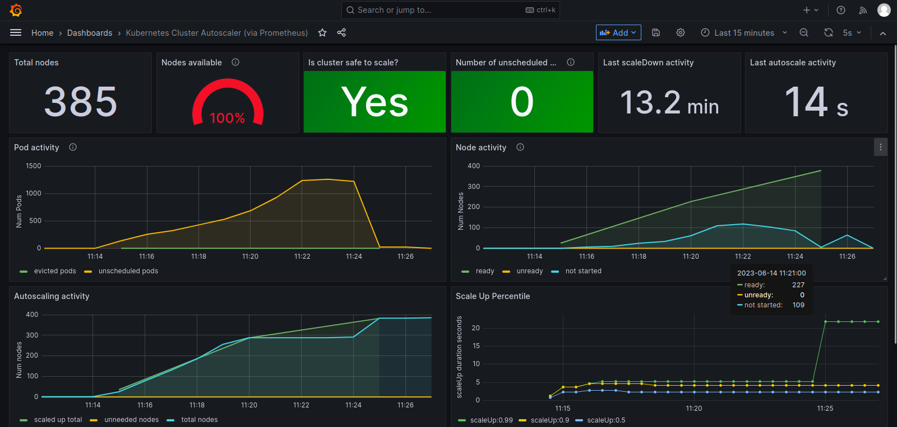

# KWOK (Kubernetes without Kubelet) cloud provider

*This doc was originally a part of https://github.com/kubernetes/autoscaler/pull/5869*
## Introduction
> [KWOK](https://sigs.k8s.io/kwok) is a toolkit that enables setting up a cluster of thousands of Nodes in seconds. Under the scene, all Nodes are simulated to behave like real ones, so the overall approach employs a pretty low resource footprint that you can easily play around on your laptop.

https://kwok.sigs.k8s.io/

## Problem
### 1. It is hard to reproduce an issue happening at scale on local machine
e.g., https://github.com/kubernetes/autoscaler/issues/5769

To reproduce such issues, we have the following options today:
### (a) setup [Kubemark](https://github.com/kubernetes/design-proposals-archive/blob/main/scalability/kubemark.md) on a public cloud provider and try reproducing the issue
You can [setup Kubemark](https://github.com/kubernetes/community/blob/master/contributors/devel/sig-scalability/kubemark-guide.md) ([related](https://github.com/kubernetes/kubernetes/blob/master/test/kubemark/pre-existing/README.md))  and use the [`kubemark` cloudprovider](https://github.com/kubernetes/autoscaler/tree/master/cluster-autoscaler/cloudprovider/kubemark) (kubemark [proposal](https://github.com/kubernetes/autoscaler/blob/master/cluster-autoscaler/proposals/kubemark_integration.md)) directly or [`cluster-api` cloudprovider with kubemark](https://github.com/kubernetes-sigs/cluster-api-provider-kubemark)

In either case,

> Every running Kubemark setup looks like the following:
> 1) A running Kubernetes cluster pointed to by the local kubeconfig
> 2) A separate VM where the kubemark master is running
> 3) Some hollow-nodes that run on the Kubernetes Cluster from #1
> 4) The hollow-nodes are configured to talk with the kubemark master at #2

https://github.com/kubernetes/kubernetes/blob/master/test/kubemark/pre-existing/README.md#introduction

You need to setup a separate VM (Virtual Machine) with master components to get Kubemark running.

> Currently we're running HollowNode with a limit of 0.09 CPU core/pod and 220MB of memory. However, if we also take into account the resources absorbed by default cluster addons and fluentD running on the 'external' cluster, this limit becomes ~0.1 CPU core/pod, thus allowing ~10 HollowNodes to run per core (on an "n1-standard-8" VM node).

https://github.com/kubernetes/community/blob/master/contributors/devel/sig-scalability/kubemark-guide.md#starting-a-kubemark-cluster

Kubemark can mimic 10 nodes with 1 CPU core.

In reality it might be lesser than 10 nodes,
> Using Kubernetes and [kubemark](https://github.com/kubernetes/community/blob/master/contributors/design-proposals/scalability/kubemark.md) on GCP we have created a following 1000 node cluster setup:
>* 1 master - 1-core VM
>* 17 nodes - 8-core VMs, each core running up to 8 Kubemark nodes.
>* 1 Kubemark master - 32-core VM
>* 1 dedicated VM for Cluster Autoscaler

https://github.com/kubernetes/autoscaler/blob/master/cluster-autoscaler/proposals/scalability_tests.md#test-setup

This is a cheaper option than (c) but if you want to setup Kubemark on your local machine you will need a master node and 1 core per 10 fake nodes i.e., if you want to mimic 100 nodes, that's 10 cores of CPU + extra CPU for master node. Unless you have 10-12 free cores on your local machine, it is hard to run scale tests with Kubemark for nodes > 100.

### (b) try to get as much information from the issue reporter as possible and try to reproduce the issue by tweaking our code tests
This works well if the issue is easy to reproduce by tweaking tests e.g., you want to check why scale down is getting blocked on a particular pod. You can do so by mimicing the pod in the tests by adding an entry [here](https://github.com/kubernetes/autoscaler/blob/1009797f5585d7bf778072ba59fd12eb2b8ab83c/cluster-autoscaler/utils/drain/drain_test.go#L878-L887) and running
```
cluster-autoscaler/utils/drain$ go test -run TestDrain
```
But when you want to test an issue related to scale e.g., CA is slow in scaling up, it is hard to do.
### (c) try reproducing the issue using the same CA setup as user with actual nodes in a public cloud provider
e.g., if the issue reporter has a 200 node cluster in AWS, try creating a 200 node cluster in AWS and use the same CA flags as the issue reporter.

This is a viable option if you already have a cluster running with a similar size but otherwise creating a big cluster just to reproduce the issue is costly.

### 2. It is hard to confirm behavior of CA at scale
For example, a user with a big Kubernetes cluster (> 100-200 nodes) wants to check if adding scheduling properties to their workloads (node affinity, pod affinity, node selectors etc.,) leads to better utilization of the nodes (which saves cost). To give a more concrete example, imagine a situation like this:
1. There is a cluster with > 100 nodes. cpu to memory ratio for the nodes is 1:1, 1:2, 1:8 and 1:16
2. It is observed that 1:16 nodes are underutilized on memory
3. It is observed that workloads with cpu to memory ratio of 1:7 are getting scheduled on 1:16 nodes thereby leaving some memory unused
e.g.,
1:16 node looks like this:
CPUs: 8 Cores
Memory: 128Gi

workload (1:7 memory:cpu ratio):
CPUs: 1 Core
Memory: 7 Gi

resources wasted on the node: 8 % 1 CPU(s) + 128 % 7 Gi
= 0 CPUs + 2 Gi memory = 2Gi of wasted memory

1:8 node looks like this:
CPUs: 8 Cores
Memory: 64 Gi

workload (1:7 memory:cpu ratio):
CPUs: 1 Core
Memory: 7 Gi

resources wasted on the node: 8 % 1 CPU(s) + 64 % 7 Gi
= 0 CPUs + 1 Gi memory = 1Gi of wasted memory

If 1:7 can somehow be scheduled on 1:8 node using node selector or required node affinity, the wastage would go down. User wants to add required node affinity on 1:7 workloads and see how CA would behave without creating actual nodes in public cloud provider. The goal here is to see if the theory is true and if there are any side-effects.

This can be done with Kubemark today but a public cloud provider would be needed to mimic the cluster of this size. It can't be done on a local cluster (kind/minikube etc.,).

### How does it look in action?
You can check it [here](https://github.com/kubernetes/autoscaler/issues/5769#issuecomment-1590541506).

### FAQ
1. **Will this be patched back to older releases of Kubernetes?**

    As of writing this, the plan is to release it as a part of Kubernetes 1.28 and patch it back to 1.27 and 1.26.
2. **Why did we not use GRPC or cluster-api provider to implement this?**
The idea was to enable users/contributors to be able to scale-test issues around different cloud providers (e.g., https://github.com/kubernetes/autoscaler/issues/5769). Implementing the `kwok` provider in-tree means we are closer to the actual implementation of our most-used cloud providers (adding gRPC communication in between would mean an extra delay which is not there in our in-tree cloud providers). Although only in-tree provider is a part of this proposal, overall plan is to:
    * Implement in-tree provider to cover most of the common use-cases
    * Implement `kwok` provider for `clusterapi` provider so that we can provision `kwok` nodes using `clusterapi` provider ([someone is already working on this](https://kubernetes.slack.com/archives/C8TSNPY4T/p1685648610609449))
    * Implement gRPC provider if there is user demand
3. **How performant is `kwok` provider really compared to `kubemark` provider?**
`kubemark` provider seems to need 1 core per 8-10 nodes (based on our [last scale tests](https://github.com/kubernetes/autoscaler/blob/master/cluster-autoscaler/proposals/scalability_tests.md#test-setup)). This means we need roughly 10 cores to simulate 100 nodes in `kubemark`.
`kwok` provider can simulate 385 nodes for 122m of CPU and 521Mi of memory. This means, CPU wise `kwok` can simulate 385 / 0.122 =~ 3155 nodes per 1 core of CPU.


4. **Can I think of `kwok` as a dry-run for my actual `cloudprovider`?**
That is the goal but note that the definition of what exactly `dry-run` means is not very clear and can mean different things for different users. You can think of it as something similar to a `dry-run`.
