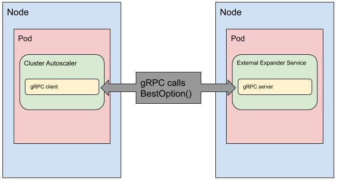

# Expander Plugin over gRPC

Authors:
Evan Sheng (evan.sheng@airbnb.com) @evansheng

## Context and Rationale

Cluster Autoscaler makes node scaling decisions based on Expander strategies, to select which node group to add nodes to.
Currently, there are 5 expanders: random, most-pods, least-waste, price, and priority. These provide a variety of behaviors in which CA behaves to expand a cluster.

However, whenever users would like to implement a customer expander they must either submit a change upstream, or fork CA and maintain their own implementation.
Iteration time would be slow, and oftentimes, users may have a case where they want to implement custom business logic into the expander that may not be relevant to the wider community, but do not want to maintain a fork.

Namely, we (Airbnb) would like to iterate on custom expander strategies (such as a weighted random expander, custom spot market strategy, etc) out of band with CA.
To do this, we propose a solution that adds a new expander to CA, but does not break backwards compatibility.


## Proposal

We will extend CA to utilize a pluggable external expander. The design for this expander plugin is heavily based off of this [proposal](https://github.com/kubernetes/autoscaler/blob/master/cluster-autoscaler/proposals/plugable-provider-grpc.md) to CA, for a pluggable cloud provider interface.
 
The solution will include a server acting as an external expander alongside CA, and communicate via gRPC with TLS. This expander will run in another pod, as a separate service, deployed independently of CA.
This is depicted below.



The gRPC server must implement the API of the [expander strategy interface](https://github.com/kubernetes/autoscaler/blob/master/cluster-autoscaler/expander/expander.go#L50) in CA, which only has one method.


```go
// Strategy describes an interface for selecting the best option when scaling up
type Strategy interface {
BestOption(options []Option, nodeInfo map[string]*schedulerframework.NodeInfo) *Option
}
```

The gRPC service, running as an external pod, is defined below:

```protobuf
syntax = "proto3";

package clusterautoscaler.expander.v1;

import "google/protobuf";
import "k8s.io/autoscaler/cluster-autoscaler/cloudprovider/generated.proto";
import "k8s.io/api/core/v1/generated.proto";

option go_package = "v1";

service Expander {
  rpc BestOption (BestOptionRequest)
    returns (BestOptionResponse) {}
}
```
The messages used in these calls are also defined:
```protobuf
message BestOptionRequest {
  repeated Option options = 1;
  map<string, schedulerframework.NodeInfo> nodeInfo = 2;
}

message BestOptionResponse {
 Option option = 1;
}

message Option {
 k8s.io.autoscaler.cluster-autoscaler.cloudprovider.NodeGroup nodeGroup = 1;
 int32 nodeCount = 2;
 string debug = 3;
 repeated k8s.io.api.core.v1.Pod pod = 4;
}
```

If errors arise with the gRPC server, the client will handle these by falling back to the random expander strategy, similarly to the fallbacks of the current expanders.

To communicate with the external gRPC server, CA needs new flags to expose details about the server.

We’ll add a new option to the expander flag: `--expander=externalgrpc`, and inntroduce a new flag `--expander-plugin-url=https://external-grpc-url/server` to reach the gRPC server.

Additionally, we’ll need to use TLS for secure communication. An additional flag `--external-expander-cert=~/path/to/cert` will be exposed to specify the path to the certificate authority bundle used to validate the TLS cert used by the server.
