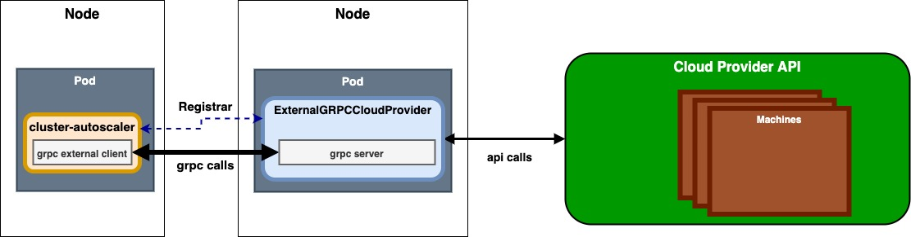

# Plugable Cloud Provider over gRPC


Authors:

* Hector Fernandez <<hfernandez@d2iq.com>> (@hectorj2f)


## Motivation

CA is released as a bundle which includes a hardcoded list of supported cloud providers.
Whenever users want to implement the logic of their own cloud provider, they need to fork the CA and add their own implementation.

In particular users need to follow these steps to support a custom private cloud:

* Write a client for your private cloud in Go, implementing CloudProvider interface.

* Add constructing it to cloud provider builder.

* Build a custom image of Cluster Autoscaler that includes those changes and configure it to start with your cloud provider.

This is a concern that has been raised in the past [PR953](https://github.com/kubernetes/autoscaler/issues/953) and [PR1060](https://github.com/kubernetes/autoscaler/issues/1060).

Therefore a new implementation should be added to CA in order to extend it without breaking any backwards compatibility or
the current cloud provider implementations.

## Goals

* Support custom cloud provider implementations without changing the current `CloudProvider` interface.
* Make CA extendable, so users do not need to fork the CA repository.
* Add a mock gRPC provider to test this new functionality.

## Proposal

There are couple of examples of pluggable designs using Go SDKs that would guide us on how to extend CA
to support custom providers as plugins.
This approach is inspired based on [Hashicorp go-plugin](https://github.com/hashicorp/go-plugin) and [Grafana Go SDK for plugins](https://github.com/grafana/grafana-plugin-sdk-go).

The proposed solution will deploy the external grpc provider along side CA and both communicates via gRPC with TLS/SSL. The external provider would be part of a separate deployment, and so we should deploy it independently, as shown in the .

This approach exposes a common gRPC API server.


The API calls would be defined by the operations exposed by the `CloudProvider` and `NodeGroup` interfaces in [CA](https://github.com/kubernetes/autoscaler/blob/master/cluster-autoscaler/cloudprovider/cloud_provider.go#L50):

```go
type CloudProvider interface {
	Name() string

	NodeGroups() []NodeGroup

	NodeGroupForNode(*apiv1.Node) (NodeGroup, error)

	Pricing() (PricingModel, errors.AutoscalerError)

	NewNodeGroup(machineType string, labels map[string]string, systemLabels map[string]string,
		taints []apiv1.Taint, extraResources map[string]resource.Quantity) (NodeGroup, error)

	GetResourceLimiter() (*ResourceLimiter, error)

	GPULabel() string

	GetAvailableGPUTypes() map[string]struct{}

	Cleanup() error

	Refresh() error

  ...
}

type NodeGroup interface {
	MaxSize() int

	MinSize() int

	TargetSize() (int, error)

	IncreaseSize(delta int) error

	DeleteNodes([]*apiv1.Node) error

	DecreaseTargetSize(delta int) error

	Id() string

	Nodes() ([]Instance, error)

	TemplateNodeInfo() (*schedulerframework.NodeInfo, error)

	Exist() bool

	Create() (NodeGroup, error)

	Delete() error

	Autoprovisioned() bool
}

```

In the following I detail the main operations of the CloudProvider GRPC service:

```protobuf
syntax = "proto3";

package clusterautoscaler.cloudprovider.v1;

import "google/protobuf/descriptor.proto";
import "google/protobuf/timestamp.proto";
import "google/protobuf/wrappers.proto";

import "k8s.io/apimachinery/pkg/apis/meta/v1/generated.proto";
import "k8s.io/apimachinery/pkg/api/resource/generated.proto";
import "k8s.io/api/core/v1/generated.proto"

option go_package = "v1";

service CloudProvider {
  // CloudProvider specific RPC functions

  rpc NodeGroups(NodeGroupsRequest)
    returns (GetNameResponse) {}    

  rpc NodeGroupForNode(NodeGroupForNodeRequest)
    returns (NodeGroupForNodeResponse) {}

  rpc PricingNodePrice(PricingNodePriceRequest) // Optional
    returns (PricingNodePriceResponse) {}

  rpc PricingPodPrice(PricingPodPriceRequest) // Optional
    returns (PricingPodPriceResponse)

  rpc GPULabel(GPULabelRequest)
    returns (GPULabelResponse) {}  

  rpc GetAvailableGPUTypes(GetAvailableGPUTypesRequest)
    returns (GetAvailableGPUTypesResponse) {}   

  rpc Cleanup(CleanupRequest)
    returns (CleanupResponse) {}        

  rpc Refresh(RefreshRequest)
    returns (RefreshResponse) {}

  // NodeGroup specific RPC functions
  rpc NodeGroupTargetSize(NodeGroupTargetSizeRequest)
    returns (NodeGroupTargetSizeResponse) {}        

  rpc NodeGroupIncreaseSize(NodeGroupIncreaseSizeRequest)
    returns (NodeGroupIncreaseSizeResponse) {}    

  rpc NodeGroupDeleteNodes(NodeGroupDeleteNodesRequest)
    returns (NodeGroupDeleteNodesResponse) {}    

  rpc NodeGroupDecreaseTargetSize(NodeGroupDecreaseTargetSizeRequest)
    returns (NodeGroupDecreaseTargetSizeResponse) {}         

  rpc NodeGroupNodes(NodeGroupNodesRequest)
    returns (NodeGroupNodesResponse) {}

  rpc NodeGroupTemplateNodeInfo(NodeGroupDTemplateNodeInfoRequest)
    returns (NodeGroupTemplateNodeInfoResponse) {}                                                               
}
```

Note that, the rest of message used in these calls are detailed in the [Appendix](#appendix) section.

Among all the operations, the CA calls in many places the function `NodeGroupForNode`.
As a consequence this operation might impact the overall performance of the CA when calling it via a remote external cloud provider.
A solution is to cache the rpc responses of this operation to avoid causing a performance degradation.
Another proposed alternative could be to move the entire logic of this function to the CA source code.
Initially this proposal assumes the rpc responses for this operation are cached to avoid any performance degradation.

In order to talk to the custom cloud provider server, this new cloud provider has to be registered
when bootstrapping the CA.
Consequently, the CA needs to expose new flags to specify the cloud provider and all the required properties
to reach the remote gRPC server.

A new flag, named
`--cloud-provider-url=https://local.svc.io/mycloudprovider/server`, determines the URL to reach the custom provider implementation.
In addition this approach reuses the existing flag that defines the name of the cloud provider using a pre-defined value `--cloud-provider=externalgrpc`
https://github.com/kubernetes/autoscaler/tree/master/cluster-autoscaler/cloudprovider. `externalgrpc` defines the usage
of an external cloud provider whose interface is handled by a remote gRPC service.

To connect the CA core with this new external cloud provider, this approach needs to implement a new generic cloud provider
as part of the CA core code.
This new provider, named `ExternalGrpcCloudProvider`, makes gRPC calls to the remote functions exposed by the external cloud provider server. In other words, it forwards the calls and handle the errors analogously how done in other existing providers.

Obviously, this new approach needs to use TLS to ensure a secure communication between CA and this CA provider server.
Additional flags should be added to specify the path where to find the certificate to establish the communication to
the external cloud provider server.
This certificate would be mounted when deploying the cluster-autoscaler on the cluster.

## User Stories

### Story1

When using CA only a reduced list of cloud providers are supported, if users want to use their own private cloud provider (e.g. Openstack, OpenNebula,...), they need to implement its cloud provider interface for that environment.
This design limits the extensibility of CA and goes against certain native Kubernetes primitives.

This approach aims to make CA pluggable allowing to create experimental providers without needing to change the base CA repository. This new experimental provider only needs to implement the gRPC defined operations.


## Appendix

In the following we detail all the message used in the defined actions of the `CloudProvider` GRPC Service server.

### NodeGroups

NodeGroups stores all node groups configured for this cloud provider.

```protobuf

message NodeGroupsRequest {
  // Intentionally empty.
}

message NodeGroupsResponse {
  // All the node groups that the cloud provider service supports. This
  // field is OPTIONAL.
  repeated NodeGroup nodeGroups = 1;
}
```

### ExternalGrpcNode

ExternalGrpcNode is a custom type. This object defines the minimum required properties of a given Kubernetes node for a node group.
This new type reduces the amount of data transferred in all the operations instead of
sending the whole `k8s.io.api.core.v1.Node` rpc message.

```protobuf
message ExternalGrpcNode{
	// ID of the node assigned by the cloud provider in the format: <ProviderName>://<ProviderSpecificNodeID>
	// +optional
	optional string providerID = 1;

	// Name of the node assigned by the cloud provider
	optional string name = 2;

	// labels is a map of {key,value} pairs with the node's labels.
	map<string, string> labels = 3;


	// If specified, the node's annotations.
	map<string, string> annotations = 4;
}
```

Initially, we defined a list of 4 properties, but this list could increase during the implementation phase.

### NodeGroupForNode

NodeGroupForNode returns the node group for the given node, nil if the node should not be processed by cluster autoscaler, or non-nil error if such occurred. Must be implemented.

**IMPORTANT:** Please note, this operation is extensively used by CA and can cause some performance degradations on large clusters.
The initial proposal assumes the rpc responses are cached to offload the performance impact of constantly calling this function.

```protobuf
message NodeGroupForNodeRequest {
  // Node group for the given node
  ExternalGrpcNode node = 1;
}

message NodeGroupForNodeResponse {
  // The node group for the given node.
  repeated NodeGroup nodeGroup = 1;
}

message NodeGroupForNodeRequest {
  // Node group for the given node
  ExternalGrpcNode node = 1;
}

```

### GetAvailableGPUTypes

GetAvailableGPUTypes handles all available GPU types cloud provider supports.

```protobuf
message GetAvailableGPUTypesRequest {
  // Intentionally empty.
}

message GetAvailableGPUTypesResponse {
 // GPU types passed in as opaque key-value pairs.
  map<string, Any> gpuTypes = 1;
}
```

### GPULabel

GPULabel stores the label added to nodes with GPU resource.

```protobuf
message GPULabelRequest {
  // Intentionally empty.
}

message GPULabelResponse {
  // Label value of the GPU
 string label = 1;
}
```

### PricingNodePrice

NodePrice handles an operation that returns a price of running the given node for a given period of time.
PricingNodePrice is an optional operation that is not implemented by all the providers.

```protobuf
message PricingNodePriceRequest {
  ExternalGrpcNode node = 1;,

  k8s.io.apimachinery.pkg.apis.meta.v1.Time startTime = 2;

  k8s.io.apimachinery.pkg.apis.meta.v1.Time endTime = 3;
}

message PricingNodePriceResponse {
 // Price of the theoretical minimum price of running a pod for a given period
 float64 price = 1;
}
```

### PricingPodPrice

PodPrice handles an operation that returns a theoretical minimum price of running a pod for a given period of time on a perfectly matching machine.
PricingPodPrice is an optional operation that is not implemented by all the providers.


```protobuf
message PricingPodPriceRequest {
  k8s.io.api.core.v1.Pod pod = 1;,

  k8s.io.apimachinery.pkg.apis.meta.v1.Time startTime = 2;

  k8s.io.apimachinery.pkg.apis.meta.v1.Time endTime = 3;
}

message PricingPodPriceResponse {
 // Price of the theoretical minimum price of running a pod for a given period
 float64 price = 1;
}
```

### Refresh

Refresh is called before every main loop and can be used to dynamically update cloud provider state.
In particular the list of node groups returned by NodeGroups can change as a result of this action.

```protobuf
message RefreshRequest {
  // Intentionally empty.
}

message RefreshResponse {
// Intentionally empty.
}
```

### Cleanup

Cleanup cleans up open resources before the cloud provider is destroyed, i.e. go routines etc.

```protobuf
message CleanupRequest {
  // Intentionally empty.
}

message CleanupResponse {
// Intentionally empty.
}
```

### NodeGroup

```protobuf
message NodeGroup {
  // ID of the node group on the cloud provider
  string id = 1;

  // MinSize of the node group on the cloud provider
  int32 minSize = 2;

  // MaxSize of the node group on the cloud provider
  int32 maxSize = 3;

  // Debug returns a string containing all information regarding this node group.
  string debug = 4;
}
```

### NodeGroupTargetSize

NodeGroupTargetSize returns the current target size of the node group.

```protobuf
message NodeGroupTargetSizeRequest {
  // ID of the group node on the cloud provider
  string id = 1;
}

message NodeGroupTargetSizeResponse {
  // TargetSize
 int32 targetSize = 1;
}
```

### NodeGroupIncreaseSize

NodeGroupIncreaseSize describes the message type of an action that increases the size of the node group.

```protobuf
message NodeGroupIncreaseSizeRequest {
 int32 delta = 1;

 // ID of the group node on the cloud provider
 string id = 2;
}

message NodeGroupIncreaseSizeResponse {
  // Intentionally empty.
}
```

### NodeGroupDeleteNodes

NodeGroupDeleteNodes deletes nodes from this node group.

```protobuf
message NodeGroupDeleteNodesRequest {
 repeated ExternalGrpcNode nodes = 1;

 // ID of the group node on the cloud provider
 string id = 2;
}

message NodeGroupDeleteNodesResponse {
  // Intentionally empty.
}
```

### NodeGroupDecreaseTargetSize

NodeGroupDecreaseTargetSize decreases the target size of the node group.

```protobuf
message NodeGroupDecreaseTargetSizeRequest {
 int32 delta = 1;

 // ID of the group node on the cloud provider
 string id = 2;
}

message NodeGroupDecreaseTargetSizeResponse {
  // Intentionally empty.
}
```

### NodeGroupNodes

NodeGroupNodes describes the message type of an action that returns a list of all nodes that belong to this node group.

```protobuf
message NodeGroupNodesRequest {
  // ID of the group node on the cloud provider
  string id = 1;
}

message NodeGroupNodesResponse {
  repeated Instance instances = 1;
}

message Instance {
	// Id is instance id.
	string id = 1;
	// Status represents status of node. (Optional)
	InstanceStatus status = 2;
}

// InstanceStatus represents instance status.
message InstanceStatus {
	// InstanceState tells if instance is running, being created or being deleted
	enum InstanceState {
		// InstanceRunning means instance is running
		InstanceRunning = 1
		// InstanceCreating means instance is being created
		InstanceCreating = 2
		// InstanceDeleting means instance is being deleted
		InstanceDeleting = 3;
	}
	// ErrorInfo is not nil if there is error condition related to instance.
	InstanceErrorInfo errorInfo = 2;
}

// InstanceErrorInfo provides information about error condition on instance
message InstanceErrorInfo {
	// ErrorCode is cloud-provider specific error code for error condition
	string errorCode = 1;
	// ErrorMessage is human readable description of error condition
	string errorMessage = 2;
  // InstanceErrorClass defines class of error condition
  int instanceErrorClass = 3;
}
```

### NodeGroupTemplateNodeInfo

TemplateNodeInfo returns a NodeInfo as a structure of an empty (as if just started) node.
The definition of a generic `NodeInfo` for each potential provider is a pretty complex approach and does not cover all the scenarios.
For the sake of simplicity, the `nodeInfo` is defined as a Kubernetes `k8s.io.api.core.v1.Node` type
where the system could still extract certain info about the node.


```protobuf
message NodeGroupTemplateNodeInfoRequest {
  // ID of the group node on the cloud provider
  string id = 1;
}

message NodeGroupTemplateNodeInfoResponse {
  // nodeInfo extracted data from the cloud provider node using a primitive Kubernetes Node type.
  k8s.io.api.core.v1.Node nodeInfo = 1;
}
```
