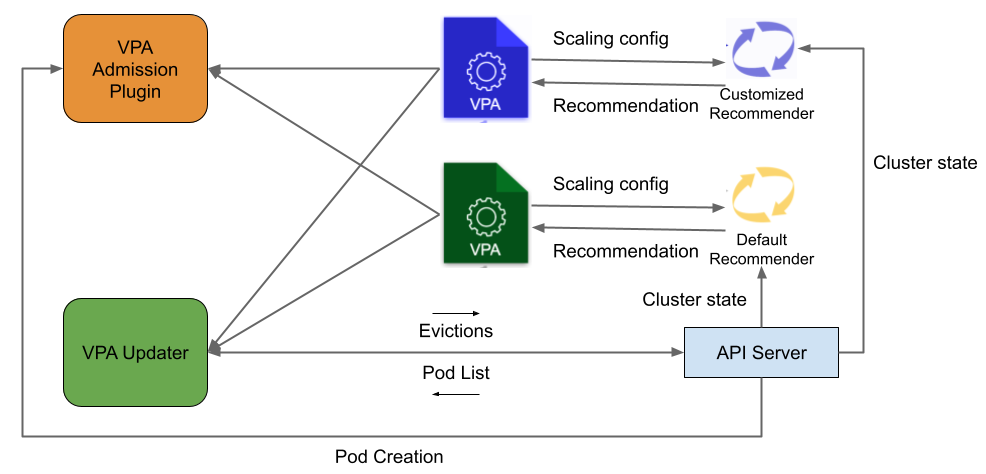

# Support Customized Recommenders for Vertical Pod Autoscalers

<!-- toc -->
- [Summary](#summary)
- [Motivation](#motivation)
  - [Goals](#goals)
  - [Non-Goals](#non-goals)
- [Proposal](#proposal)
  - [User Stories](#user-stories-optional)
    - [Story 1](#story-1)
    - [Story 2](#story-2)
  - [Implementation Details](#implementation-details)
  - [Deployment Details](#deployment-details)
- [Design Details](#design-details)
  - [Test Plan](#test-plan)
  - [Upgrade / Downgrade Strategy](#upgrade--downgrade-strategy)
- [Alternatives](#alternatives)
- [Out of Scope](#out-out-scope)
- [Implementation History](#implementation-history)
<!-- /toc -->

## Summary

Today, the current VPA recommends CPU/Mem requests based on one recommender, 
which recommends the future requests based on the historical usage observed in a 
rolling time window. As there is no universal recommendation policy that applies
to all types of workloads, this KEP suggests supporting multiple customized
recommenders in VPA. Thus, users can run different recommenders for different
workloads, as they may exhibit very distinct resource usage behaviors.

## Motivation

A VPA is used to recommend the requested resources of containers in pods when the actual CPU/memory usage of a container 
is significantly different from the resources requested. Resource usage-based recommendation 
is the basic approach that resizes containers according to the actual usage observed and is 
implemented in the default VPA recommender. Users can configure the time window and a certain 
percentile of observed usage in the past as the prediction of future requests/limits for CPU/memory.

However, as containers running different types of workloads may have different resource usage patterns, 
there is no universal policy that applies to all. The existing VPA recommender may not accurately 
predict future resource usage when containers exhibit certain resource usage behaviors, 
such as trending, periodically changing, or occasional spikes, resulting in significant 
over-provisioning and OOM kills for microservices. Learning different types of resource usage 
behaviors for workloads and applying different algorithms to improve resource utilization 
(CPU and Memory) predictions can significantly reduce over-provisioning and OOM kills in VPA.

### Goals

- Allow the VPA object to specify a customized recommender to use. 
- Allow the VPA object to use the default recommender when no recommender is specified.
- Don't block future changes that will allow a VPA object to use multiple recommenders at the same time.

### Non-Goals

- We assume no pod uses two recommenders at the same time.
- We do not resolve conflicts between recommenders.

## Proposal

### User Stories

#### Story 1 

- Containers with Cyclic Patterns in Resource Usage

Containers used in monitoring may receive load periodically to process but need to be long-running 
to listen to incoming traffic. Thus, these containers usually exhibit cyclic patterns, alternating 
between usage spikes and idling. Resizing containers according to usage observed in the previous 
time window may always lead to under-provision for a short period when the load spikes just arrive. 
The problem will happen for memory if the cyclic pattern length is >8 days. For CPU, the problem may 
be visible for example with lower usage on the weekend. The problem will even lead to frequent pod evictions 
when the pod was resized according to the idling period and the host resource has been taken by other pods.

#### Story 2 

- Containers with Different but Recurrent Behaviors in Resource Usage

Containers running spark/deep learning training workloads are known to show recurring and repeating 
patterns in resource usage. Prior research has shown that different but recurrent behaviors occur 
for different containerized tasks, such as Spark or deep learning training. These common patterns can 
be represented by phases, which display similar resource usage of computational resources over time. 
There are common sequences of patterns for different executions of the workload and they can be used 
to proactively predict future resource usage more accurately. The default recommender in the current 
VPA adopts a reactive approach so a more proactive recommender is needed for these types of workload.

### Implementation Details

The following describes the details of implementing a first-citizen approach to
support the customized recommender. Namely, a dedicated field `recommenders` is
added to the VPA crd definition in `deploy/vpa-v1.crd.yaml`. We identify
recommender to use with a struct containing name of the recommender rather than
using a plain string to identify the recommender. This will allow us to pass
parameters to recommenders if we need to do that in the future.

```yaml
validation:
 # openAPIV3Schema is the schema for validating custom objects.
 openAPIV3Schema:
   type: object
   properties:
     spec:
       type: object
       required: []
       properties:
         recommenders:
           type: array
           items:
             properties:
               name:
                 description: Name of the recommmender
                 type: string
             type: object
         targetRef:
           type: object
         updatePolicy:
           type: object
```

Correspondingly, the `VerticalPodAutoscalerSpec` in `pkg/apis/autoscaling.k8s.io/v1/types.go` 
should be updated to include the `recommenders` field.

```golang

// VerticalPodAutoscalerRecommenderSelector points to a specificic Vertical Pod Autoscaler recommender
// in the future it might pass parameters to the recommender.
type VerticalPodAutoscalerRecommenderSelector struct {
  // Name of the recommender responsible for generating recommendation for this object.
  Name string `json:"name" protobuf:"bytes,1,opt,name=name"`
}

// VerticalPodAutoscalerSpec is the specification of the behavior of the autoscaler.
type VerticalPodAutoscalerSpec struct {
	// TargetRef points to the controller managing the set of pods for the
	// autoscaler to control - e.g. Deployment, StatefulSet. VerticalPodAutoscaler
	// can be targeted at controller implementing scale subresource (the pod set is
	// retrieved from the controller's ScaleStatus) or some well known controllers
	// (e.g. for DaemonSet the pod set is read from the controller's spec).
	// If VerticalPodAutoscaler cannot use specified target it will report
	// ConfigUnsupported condition.
	// Note that VerticalPodAutoscaler does not require full implementation
	// of scale subresource - it will not use it to modify the replica count.
	// The only thing retrieved is a label selector matching pods grouped by
	// the target resource.
	TargetRef *autoscaling.CrossVersionObjectReference `json:"targetRef" protobuf:"bytes,1,name=targetRef"`

	// Describes the rules on how changes are applied to the pods.
	// If not specified, all fields in the `PodUpdatePolicy` are set to their
	// default values.
	// +optional
	UpdatePolicy *PodUpdatePolicy `json:"updatePolicy,omitempty" protobuf:"bytes,2,opt,name=updatePolicy"`

	// Controls how the autoscaler computes recommended resources.
	// The resource policy may be used to set constraints on the recommendations
	// for individual containers. If not specified, the autoscaler computes recommended
	// resources for all containers in the pod, without additional constraints.
	// +optional
	ResourcePolicy *PodResourcePolicy `json:"resourcePolicy,omitempty" protobuf:"bytes,3,opt,name=resourcePolicy"`
	// Recommender responsible for generating recommendation for this object.
	// List should be empty (then the default recommender will generate the
	// recommendation) or contain exactly one recommender.
	// +optional
	Recommenders []*VerticalPodAutoscalerRecommenderSelector `json:"recommenders,omitempty" protobuf:"bytes,4,opt,name=recommenders"`
}
```

When creating a recommender object for recommendations, the recommender main routine should initiate itself 
with a predefined recommender name, which can be defined as a constant in the `pkg/recomender/main.go` routine,

```golang
const RecommenderName = "default"

recommender := routines.NewRecommender(config, *checkpointsGCInterval, useCheckpoints, RecommenderName, *vpaObjectNamespace)
```

where the `routines.NewRecommender` can pass the `RecommenderName` to the `clusterState` object.

```golang
// NewRecommender creates a new recommender instance.
// Dependencies are created automatically.
// Deprecated; use RecommenderFactory instead.
func NewRecommender(config *rest.Config, checkpointsGCInterval time.Duration, useCheckpoints bool, recommender_name string, namespace string) Recommender {
  clusterState := model.NewClusterState(recommender_name)
  return RecommenderFactory{
     ClusterState:           clusterState,
     ClusterStateFeeder:     input.NewClusterStateFeeder(config, clusterState, *memorySaver, namespace),
     CheckpointWriter:       checkpoint.NewCheckpointWriter(clusterState, vpa_clientset.NewForConfigOrDie(config).AutoscalingV1()),
     VpaClient:              vpa_clientset.NewForConfigOrDie(config).AutoscalingV1(),
     PodResourceRecommender: logic.CreatePodResourceRecommender(),
     CheckpointsGCInterval:  checkpointsGCInterval,
     UseCheckpoints:         useCheckpoints,
  }.Make()
}


// NewClusterState returns a new ClusterState with no pods.
func NewClusterState(recommender_name string) *ClusterState {
  return &ClusterState{
     RecommenderName:   recommender_name,
     Pods:              make(map[PodID]*PodState),
     Vpas:              make(map[VpaID]*Vpa),
     EmptyVPAs:         make(map[VpaID]time.Time),
     aggregateStateMap: make(aggregateContainerStatesMap),
     labelSetMap:       make(labelSetMap),
  }
}
```

Therefore, when loading VPA objects to the `clusterStateFeeder`, it should
ignore VPA objects that don't have an item in the `recommenders` field with
`name` equal to the current clusterState’s `RecommenderName`.

```golang
func implicitDefaultRecommender(selectors[]*VerticalPodAutoscalerRecommenderSelector) bool {
	return len(selectors) == 0
}

func selectsRecommender(selectors[]*VerticalPodAutoscalerRecommenderSelector, name *string) bool {
	for _, s := range(selectors) {
		if s.Name == *name {
			return true
		}
	}
	return false
}

// Fetch VPA objects and load them into the cluster state.
func (feeder *clusterStateFeeder) LoadVPAs() {
  // List VPA API objects.
  allVpaCRDs, err := feeder.vpaLister.List(labels.Everything())
  if err != nil {
     klog.Errorf("Cannot list VPAs. Reason: %+v", err)
     return
  }

  var vpaCRDs []*vpa_types.VerticalPodAutoscaler
  for _, vpaCRD := range allVpaCRDs {
     currentRecommenderName := feeder.clusterState.RecommenderName
     if (!implicitDefaultRecommender(vpaCRD.Spec.Recommenders) && !selectsRecommender(vpaCRD.Spec.Recommenders, currentRecommenderName)) {
        klog.V(6).Infof("Ignoring the vpaCRD as current recommender's name %v doesn't appear among its recommenders", currentRecommenderName)
        continue
     }
     vpaCRDs = append(vpaCRDs, vpaCRD)

  klog.V(3).Infof("Fetched %d VPAs.", len(vpaCRDs))
  // Add or update existing VPAs in the model.
  vpaKeys := make(map[model.VpaID]bool)

  …

  feeder.clusterState.ObservedVpas = vpaCRDs
}
```

### Deployment Details
The customized recommender is supposed to be deployed as a separate deployment
that is chosen by different sets of VPA objects. Each VPA object is supposed to
choose only one recommender at a time.
The way how the default recommender and the customized recommender are running
and interacting with VPA objects are shown in the following drawing.



Though we do not support a VPA object to use multiple recommenders in this
proposal, we leave the possibility of necessary changes of using multiple
recommenders in the future. Namely, we define `recommenders` to be an array
instead of an object, but we support one element only in this proposal. We
modify the admission controller to validate that the array has <= 1 elements.

We will add the following check in the
`func validateVPA(vpa *vpa_types.VerticalPodAutoscaler, isCreate bool)`
function.

```golang
	if len(vpa.Spec.Recommenders) > 1 {
		return fmt.Errorf("VPA object shouldn't specify more than one recommender.")
	}
```

For now we don't allow users to pass any parameters to recommenders but we leave
that as a possibility for the future. We do this by using a struct (which can be
extended if we need to) rather than a string.

## Design Details

### Test Plan
- Add e2e test demonstrating the default recommender ignores a VPA which specifies an alternate recommender.

### Upgrade / Downgrade Strategy
For cluster upgrades, the VPA from the previous version will continue working as before. 
There is no change in behavior or flags which have to be enabled or disabled.

## Alternatives

### Develop a plugin framework for customizable recommenders.
Add a webhook system for customized recommendations. The default VPA recommender would 
call any available recommendation webhooks, and if any of them make a recommendation, 
the recommender would use that recommendation instead of making its own. If none make 
a recommendation, it would make its recommendation as it currently does. The plugin alternative
is rejected because it involves much more design changes and code changes. It might be considered in the future if there are 
more use cases where running multiple recommenders for the same VPA object is needed.

### Develop a label selector approach.
Add a label for the CRD object to denote the recommender’s name. When making 
recommendations in the recommender, only the VpaCrds with the label 
`recommender=default` will be loaded and updated by the existing recommender. 
A label selector approach is rejected because it is too powerful and users can easily 
ignore those labels and misconfigure the VPA objects.

## Out of Scope

- Although this proposal will enable alternate recommenders, no alternate recommenders 
will be created as part of this proposal.
- This proposal will not support running multiple recommenders for the same VPA object. Each VPA object 
is supposed to use only one recommender. 

## Implementation History

<!--
Major milestones in the lifecycle of a KEP should be tracked in this section.
Major milestones might include:
- the `Summary` and `Motivation` sections being merged, signaling SIG acceptance
- the `Proposal` section being merged, signaling agreement on a proposed design
- the date implementation started
- the first Kubernetes release where an initial version of the KEP was available
- the version of Kubernetes where the KEP graduated to general availability
- when the KEP was retired or superseded
-->


